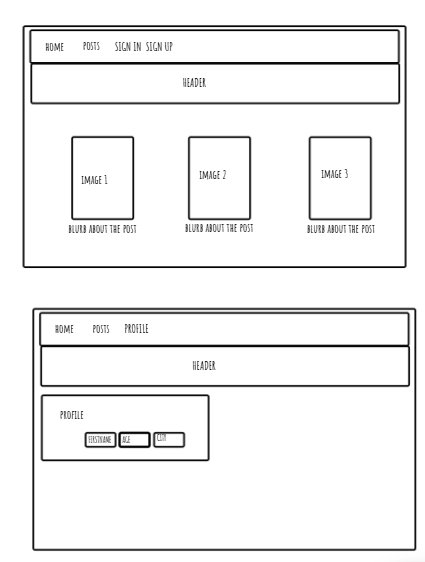
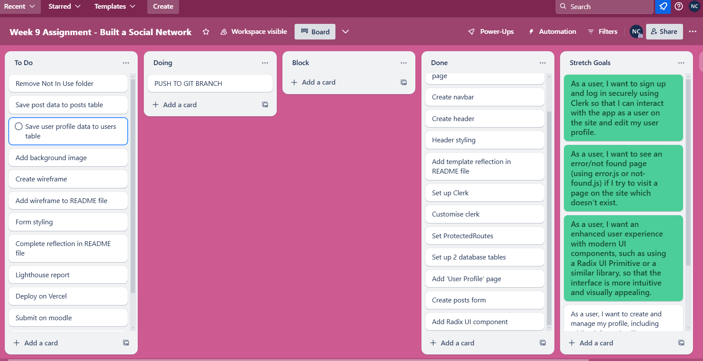

Reflection

WIREFRAME:

TRELLO:

SUPABASE SCHEMA: !Screenshot of supabase tables](image.png)

GITHUB:https://github.com/Natasha-C-creator/week9assignment

VERCEL:

---

## 🎯 What requirements did you/did not achieve?

- COMPLETE As a user, I want to sign up and log in securely using Clerk so that I can interact with the app as a user on the site
- COMPLETE (SORTOFNOTREALLY?!) - and edit my user profile.
- COMPLETE As a user, I want to see an error/not found page (using error.js or not-found.js) if I try to visit a page on the site which doesn’t exist.
- COMPLETE (in a veryVERYVERYbasic manner with one Radix popover) As a user, I want an enhanced user experience with modern UI components, such as using a Radix UI Primitive or a similar library, so that the interface is more intuitive and visually appealing.
- INCOMPLETE As a user, I want to create and manage my profile, including adding information like a biography, so that I can personalise my account.
- INCOMPLETE As a user, I want to create my posts to be displayed on my profile page so that I can share and manage my content easily.

---

## 🎯 If so, what was it that you found difficult about these tasks?

----What went really well and what could have gone better?

- I changed tack for this week's assignment! This week, instead of thinking I needed to fly solo and figure it all out by myself, I've worked out that I could follow along to all of the recordings and the moodle docs to piece everything together. Who knew!!
- I decided to try and actually get the app to correctly function rather than worrying about styling but as it turns out, I didn't get to work on either as life had other plans!

What could have gone better:
-- Well, I really feel that this assignment would have gone better had my house not had a flood on Saturday. Yep. I returned home to a flood which meant I've spent 90% of this weekend ripping up carpets, wardrobes, skirting boards, sorting dehumidifiers etc. I'm pretty confident my assignment would have looked and operated better had I had more time! But equally, that's life, and I have adjusted/lowered my own MVP accordingly. Yes, I really did mean to have a basic grey page with forms that do not quite yet work... ;)

--Git branches. We're not friends. I totally get the concept and know the reasons for it, but on the occasions when I forget to immediately merge a branch on GitHub, it punishes me so much! I get so many errors but end up debugging that for aaaaaaaaaaaaaages. So I just stick with adding to the main branch, despite knowing it's not best practice...

-- Whilst styling isn't a strength, with sufficient time I'm confident I could get things looking reasonable. However, I really struggle with getting all of the elements to connect - form to correctly pass to the database, clerk user ID where it should be etc. I'm not expecting it from anyone, but ideally I'd love to be able to have someone mark up in big red pen with the correct answer/missing code!